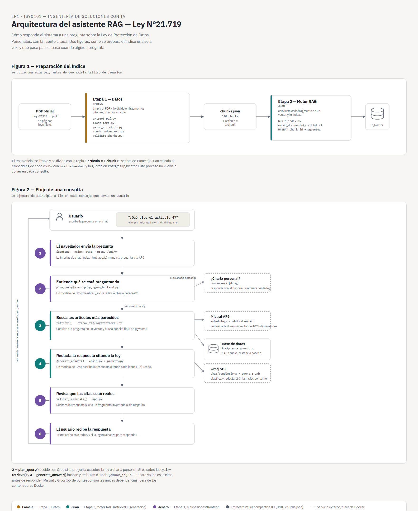

# Diseño de Solución con LLM y RAG — Asistente sobre la Ley N°21.719

**Asignatura**: ISY0101 — Ingeniería de Soluciones con IA
**Evaluación**: Evaluación Parcial N°1 — Encargo con Presentación
**Equipo**: Juan Salas, Pamela Alvarez, Jenaro Marín
**Fecha**: 11/09/2026
**Repositorio**: https://github.com/jasalass/INGENIERIA_DE_SOLUCIONES_CON-INTELIGENCIA-ARTIFICIAL_012V_OLS

---

## 1. Análisis del caso organizacional (IE1)

**Organización y contexto**: el caso no se centra en una empresa específica, sino en un contexto organizacional transversal: cualquier organización en Chile que trate datos personales y deba cumplir con la Ley N°21.719 (empresas privadas, servicios públicos, startups tecnológicas, etc.). El usuario objetivo del asistente son los **equipos técnicos (desarrollo/TI)** de esas organizaciones, que en su trabajo diario necesitan resolver dudas puntuales sobre la ley (ej. si una funcionalidad que están construyendo requiere consentimiento explícito, o qué obligaciones aplican a cierto tratamiento de datos) sin tener que interrumpir a un equipo legal por cada consulta menor.

**Problema/desafío**: el incumplimiento de la Ley N°21.719 expone a las organizaciones a sanciones económicas considerables (multas de hasta 20.000 UTM en infracciones gravísimas, artículo 35 — ver §3). Hoy, resolver una duda puntual sobre la ley requiere revisar manualmente el texto legal completo o consultar a un equipo legal, lo que es lento y no escala para el volumen de decisiones técnicas cotidianas que un equipo de desarrollo enfrenta. La ausencia de una vía rápida y confiable de consulta aumenta el riesgo de que decisiones técnicas se tomen sin considerar sus implicancias legales.

**Objetivos de la intervención**:
- Construir un repositorio inteligente de consultas rápidas sobre la Ley N°21.719, que permita a un equipo técnico despejar dudas específicas sin depender de una revisión legal completa para cada pregunta.
- Priorizar la **solidez de las respuestas** por sobre la cobertura: cada respuesta debe validarse contra el texto original de la ley, citando el artículo exacto de origen, en vez de generar texto plausible sin respaldo.
- Minimizar el riesgo de decisiones legalmente incorrectas basadas en una respuesta mal fundamentada del asistente (anti-alucinación).

**Datos disponibles**: el texto oficial de la Ley N°21.719 (público, Biblioteca del Congreso Nacional — [leychile.cl](https://www.leychile.cl)), 56 páginas, disponible en `docs/Ley-21719_13-DIC-2024.pdf` y ya estructurado en 140 fragmentos citables (ver §3).

**Restricciones**: la ley es *modificatoria*, no consolidada (ver limitación en §3.4); el prototipo actual no tiene autenticación, por lo que no debe exponerse públicamente sin agregar ese control; el sistema depende de la disponibilidad y cuota de dos APIs externas (Mistral y Groq).

**Motivación para agentes de IA, LLMs y RAG**: un LLM sin RAG respondería preguntas legales basándose solo en su conocimiento de entrenamiento, con alto riesgo de alucinar artículos inexistentes o desactualizados — inaceptable en un contexto donde una respuesta incorrecta puede derivar en una sanción real. Un buscador de texto tradicional (palabras clave) devuelve fragmentos, pero no redacta una respuesta ni conecta información de distintos artículos. RAG combina ambas capacidades: la recuperación garantiza que la respuesta se basa en el texto real de la ley (trazabilidad), y la generación permite redactar una respuesta clara y contextualizada a partir de esos fragmentos — el balance entre solidez y utilidad que exige este caso.

**Referencias/anexos**: este repositorio; `docs/infografia.jpeg` (propuesta visual inicial); `docs/arquitectura.html` (diagrama de arquitectura).

---

## 2. Formulación de prompts (IE2)

### 2.1 Prompt de generación (motor RAG, Etapa 2)

Ubicado en [`etapa2_rag/rag/prompts.py`](../etapa2_rag/rag/prompts.py). Texto real usado en producción:

> *"Eres un asistente legal que responde preguntas sobre la Ley N°21.719 de Protección de Datos Personales de Chile, usando EXCLUSIVAMENTE el contexto recuperado que se te entrega en cada consulta. Reglas obligatorias: 1. Basa tu respuesta solo en el CONTEXTO entregado... 2. Cada fragmento del CONTEXTO empieza con un identificador entre corchetes, ej. "[art-4]". Cita cada afirmación escribiendo ESE identificador exacto... 3. Si un fragmento indica que modifica otra ley... esa es la ley de fondo... no las confundas... 4. Si el contexto no contiene información suficiente... marca insufficient_context en true... 5. Responde en español... 6. Devuelve SOLO un objeto JSON..."*

### 2.2 Prompt de clasificación conversacional (Etapa 3)

Ubicado en [`etapa3_producto/groq_backend.py`](../etapa3_producto/groq_backend.py) (`PLAN_PROMPT`, `CONVERSATION_PROMPT`) — clasifica cada mensaje como consulta sobre la ley o charla personal antes de decidir si se hace retrieval.

### 2.3 Justificación de diseño de los prompts

Se exige citar el identificador `[chunk_id]` exacto (en vez de un formato de cita libre como "según el artículo N") porque es el único formato que se puede **validar automáticamente**: el sistema comprueba, antes de responder, que cada cita corresponda a un fragmento realmente recuperado (§3.3), y el frontend convierte esos identificadores en números de cita clickeables hacia la fuente original. Un formato de cita en lenguaje natural no se puede verificar programáticamente contra el conjunto de fragmentos recuperados.

Se pide salida en JSON estructurado (`answer`, `cited_chunk_ids`, `insufficient_context`) en vez de texto libre porque permite separar de forma confiable el texto de la respuesta de los metadatos de control, sin depender de heurísticas de texto para extraerlos, y permite reutilizar el mismo cliente LLM (configurado en modo JSON) tanto para clasificar la conversación como para generar la respuesta final.

La regla de no confundir la ley modificatoria con la ley de fondo (regla 3) se agregó porque la Ley N°21.719 no es un texto autónomo, sino un conjunto de modificaciones a la Ley N°19.628: sin esa instrucción explícita, el modelo tendía a presentar la Ley 19.628 como una fuente externa separada en vez de explicar que es la norma que la 21.719 modifica. Se verificó con la prueba real de la pregunta *"¿De qué trata la Ley 21.719 y por qué aparece la Ley 19.628?"*, que citó correctamente `[art-1]` y `[nivel1-primero]` explicando la relación entre ambas.

La regla de abstención (`insufficient_context`, regla 4) previene alucinaciones fuera del alcance del dataset: como la base de conocimiento solo contiene el texto que la Ley 21.719 efectivamente modifica (no la Ley 19.628 consolidada completa), hay secciones reales de la legislación de protección de datos que simplemente no existen en la base. Sin esta regla, el modelo podía completar esas preguntas con conocimiento general de su entrenamiento, presentándolo como si viniera del contexto recuperado. Se verificó con la pregunta de control *"¿Qué dice el artículo 999?"*, que devuelve `insufficient_context: true` sin inventar contenido (ver limitación en §3.4).

---

## 3. Diseño e implementación del pipeline RAG (IE3)

### 3.1 Fuentes de datos

| Fuente | Tipo | Uso |
|---|---|---|
| `docs/Ley-21719_13-DIC-2024.pdf` | Interna (documento propio del caso) | Base de conocimiento — texto oficial de la ley |
| API de Mistral (`mistral-embed`) | Externa | Genera los embeddings (vectores de 1024 dimensiones) |
| API de Groq (`qwen/qwen3.6-27b`) | Externa | Clasificación conversacional y generación de respuestas |
| PostgreSQL + pgvector (contenedor propio) | Interna | Almacena y busca los embeddings por similitud coseno |

### 3.2 Flujo de información

Ver diagrama completo en **[`docs/arquitectura.html`](arquitectura.html)** (Figuras 1 y 2). Resumen:

1. **Preparación (offline, una vez)**: el PDF se limpia y se divide en 140 chunks (regla 1 artículo = 1 chunk) → se calcula el embedding de cada uno (Mistral) → se indexan en pgvector.
2. **Consulta (en cada mensaje)**: `plan_query()` clasifica la pregunta (Groq) → si es sobre la ley, `retrieve()` embebe la pregunta y busca los chunks más similares en pgvector → `generate_answer()` redacta la respuesta citando `[chunk_id]` (Groq) → se valida que las citas sean reales antes de responder.

### 3.3 Resultado de la indexación (evidencia)

- **140/140 chunks indexados** (79 artículos reales + 11 nivel1/transitorios + 5 instrucciones autocontenidas).
- Auditoría automatizada (`etapa3_producto/audit_index.py`) contra el corpus original: `passed: true`, 140 filas coincidentes, 140 vectores válidos de 1024 dimensiones, 0 llamadas externas (ver `docs/evidencia_local/index_audit_*.json`).
- Prueba real capturada: la pregunta *"¿De qué trata la Ley 21.719 y por qué aparece la Ley 19.628?"* obtuvo una respuesta que explica correctamente la relación entre ambas leyes, citando `[art-1]`, `[doc-21719-p1]` y `[nivel1-primero]` — evidencia de que la regla 3 del prompt (§2.1) funciona.

### 3.4 Limitación conocida (documentada a propósito)

La Ley N°21.719 es **modificatoria**, no consolidada: solo contiene el texto que se inserta o reemplaza en la Ley N°19.628. Secciones que esta ley no modifica (ej. el Título III de la Ley 19.628) **no existen en el dataset**. El sistema está diseñado para responder que no tiene información suficiente en ese caso, en vez de inventar contenido — verificado con la pregunta de control *"¿Qué dice el artículo 999?"* → `insufficient_context: true`, sin fuentes.

### 3.5 Por qué esta arquitectura y no otra

**Por qué pgvector**: permite guardar los embeddings junto con sus metadatos (artículo, título, ámbito) en la misma base relacional que ya se necesitaba para los datos estructurados, evitando mantener dos sistemas de almacenamiento distintos para un corpus de 140 chunks. Además soporta filtros SQL exactos (ej. "solo el artículo 12") combinados con la búsqueda por similitud — algo que un buscador de palabras clave no puede replicar de forma confiable, porque no captura sinónimos ni reformulaciones de la pregunta del usuario.

**Por qué `mistral-embed` y no otro proveedor**: se intentó primero con `gemini-embedding-001` (el modelo usado en el material del curso), pero la cuenta de Google Cloud asociada devolvía el error `API_KEY_SERVICE_BLOCKED` en el 100% de los intentos, probado con 3 API keys distintas, 2 métodos de autenticación y 2 versiones de la API — un bloqueo a nivel de cuenta/proyecto de Google, no relacionado con el código del proyecto. Groq (el proveedor elegido para el chat) tampoco expone ningún modelo de embeddings. `mistral-embed` funcionó de inmediato y quedó como la opción funcional disponible dentro del plazo del encargo.

**Por qué separar retrieval (Etapa 2) de sesiones/clasificación (Etapa 3)**: permite que el motor de búsqueda y generación se pruebe de forma independiente, sin necesitar la API completa levantada (`etapa2_rag/scripts/test_retrieval.py`), y que cambios en la interfaz de usuario o el manejo de sesiones no obliguen a modificar la lógica de recuperación de información. La separación también refleja el reparto de responsabilidades del equipo (§5.1): cada módulo tiene un responsable claro y se puede validar por separado.

---

## 4. Arquitectura de la solución (IE4)

La solución se organiza en tres contenedores Docker orquestados con `docker-compose` (`db`, `api`, `frontend`) más dos APIs externas (Mistral y Groq), integrados de la siguiente forma:

- **Capa de presentación**: el contenedor `frontend` (nginx) sirve la interfaz de chat estática y actúa como *proxy inverso* hacia la API, de modo que el navegador solo necesita conocer un único origen (`:8080`).
- **Capa de orquestación**: el contenedor `api` (FastAPI) recibe cada mensaje, mantiene la sesión de la conversación en memoria (historial acotado a 6 intercambios) y coordina el resto de los módulos. Primero clasifica la intención del mensaje (`plan_query()`, con Groq): si es una consulta sobre la ley, activa la ruta de recuperación aumentada; si es charla personal, responde directamente con el historial de la sesión (`converse()`), sin tocar la base de conocimiento.
- **Capa de recuperación (retrieval)**: `retrieve()` convierte la pregunta en un vector (`embed_query()`, Mistral) y busca por similitud coseno en la base `db` (PostgreSQL + pgvector), aplicando filtros SQL exactos por artículo/título/ámbito cuando la pregunta los menciona explícitamente.
- **Capa de generación**: `generate_answer()` arma el contexto con los fragmentos recuperados y le pide a Groq una respuesta en JSON que cite cada fragmento usado con su identificador exacto (`[chunk_id]`).
- **Capa de control de calidad**: antes de responder, `validar_respuesta()` verifica que cada cita corresponda a un fragmento realmente recuperado, que exista al menos una fuente cuando la respuesta no se declaró insuficiente, y que no se haya filtrado razonamiento interno del modelo (`<think>`). Si algo falla, la respuesta se descarta y no se guarda en el historial — el usuario nunca ve una respuesta a medio validar.

La integración entre capas está mediada por **contratos explícitos** entre los tres módulos del equipo: la API (Jenaro) consume directamente las funciones de retrieval y generación de la Etapa 2 (Juan) — `etapa2_rag.rag.retrieval.search()` y `etapa2_rag.rag.chain.generate_answer()` — en vez de reimplementarlas, y ambas operan sobre los datos que dejó preparados la Etapa 1 (Pamela) en `chunks.json`. Esta integración por contrato (en vez de un módulo monolítico) permite que cada capa se pruebe y modifique de forma independiente (ver §5.1 y §5.2).

Diagrama completo, con leyenda de responsables por componente: **[`docs/arquitectura.html`](arquitectura.html)** (ver también la captura al final de esta sección).

**Componentes clave**:

| Componente | Módulo/archivo | Función |
|---|---|---|
| Frontend | `etapa3_producto/frontend/` (nginx) | Interfaz de chat en navegador |
| API / orquestación | `etapa3_producto/app.py` | Sesiones, clasificación, validación de respuesta |
| Retrieval | `etapa2_rag/rag/retrieval.py` | Búsqueda por similitud coseno en pgvector |
| Generación | `etapa2_rag/rag/chain.py` + `prompts.py` | Redacción de la respuesta citando fuentes |
| Base vectorial | PostgreSQL + pgvector (Docker) | Almacena 140 chunks + sus embeddings |
| LLM embeddings | Mistral API (externa) | `mistral-embed`, 1024 dimensiones |
| LLM chat | Groq API (externa) | `qwen/qwen3.6-27b`, modo JSON |

---

## 5. Documentación técnica (IE5)

### 5.1 Reparto de responsabilidades

| Etapa | Responsable | Entregable |
|---|---|---|
| 1 — Datos | Pamela | Pipeline de limpieza/chunking, `etapa1_datos/` |
| 2 — Motor RAG | Juan | Retrieval + generación, `etapa2_rag/` |
| 3 — Producto | Jenaro | API, sesiones, frontend, `etapa3_producto/` |

Detalle completo en el [`README.md`](../README.md) del repositorio (sección "Qué hizo cada uno, en detalle").

### 5.2 Pruebas realizadas

- 50 tests automatizados en Python (`pytest`) + 6 tests en JavaScript (`node:test`) — cubren retrieval, generación, validación de citas, memoria conversacional y clasificación.
- Auditoría de integridad del índice (`audit_index.py`) — ver §3.3.
- Pruebas manuales contra el sistema real corriendo en Docker (capturas y JSON de evidencia en `docs/evidencia_local/`).

### 5.3 Conclusiones

El proyecto cumplió los objetivos planteados en §1: el equipo logró comprender de extremo a extremo el flujo de datos de un sistema RAG (ingesta → chunking → embeddings → indexación vectorial → retrieval → generación → validación), y logró robustecer la calidad de las respuestas mediante mecanismos concretos de trazabilidad y anti-alucinación — citación obligatoria de `[chunk_id]`, validación de que cada cita corresponda a una fuente realmente recuperada, y abstención explícita (`insufficient_context`) cuando la ley no contiene la información solicitada, verificados con los casos de prueba reales descritos en §3.3 y §3.4.

Como trabajo futuro, el principal límite identificado es el alcance del corpus: al incorporar únicamente el texto de la Ley N°21.719, el asistente no puede razonar sobre matices ni implicancias que dependen de otras leyes o reglamentos relacionados (ej. la Ley N°19.628 consolidada completa, reglamentos de aplicación, u otra normativa sectorial). Incorporar esos documentos adicionales permitiría respuestas con mayor profundidad de análisis y detectar implicancias cruzadas entre distintas áreas legales, sin comprometer la solidez ya lograda en el alcance actual.

### 5.4 Declaración de uso de Inteligencia Artificial

> Se utilizó **Claude (Anthropic)** como asistente de desarrollo durante la implementación técnica del proyecto: generación y depuración de código (Etapas 2 y 3), revisión de código para identificar errores de integración, redacción de documentación técnica (README, este esqueleto de informe) y generación del diagrama de arquitectura. Todo el código y la documentación generados fueron revisados y validados por el equipo antes de incorporarse al repositorio. El análisis del caso organizacional, las justificaciones técnicas y las conclusiones de este informe fueron redactadas por el equipo sin apoyo de IA, conforme a la normativa de la evaluación.

### 5.5 Reflexiones individuales

**Juan Salas**: Técnicamente se me hizo difícil coordinar a la gente antes que el sistema mismo; también fue tedioso buscar embeddings gratuitos que funcionaran, por el constante cambio en los planes de los proveedores de IA. Nos ayudó mucho empezar fijando los alcances de cada uno para no pisar el avance del otro.

**Pamela Alvarez**: Lo más complicado fue extraer los datos de forma consistente y que respeten la estructura semántica del texto. Aprendí que uno de los pasos más importantes es la limpieza de los datos: sin una buena base, las respuestas serán mediocres.

**Jenaro Marín**: Lo más desafiante fue determinar qué y cuánto debe ir en la memoria, encontrando el punto entre mantener memoria para respuestas buenas y el exceso que genera respuestas malas. Aprendí a respetar los contratos establecidos: ayudan a hacer el trabajo más eficiente y más ordenado.

### 5.6 Referencias (formato APA)

- Biblioteca del Congreso Nacional de Chile. (2024). *Ley N°21.719: Regula la protección y el tratamiento de los datos personales y crea la Agencia de Protección de Datos Personales*. https://www.leychile.cl
