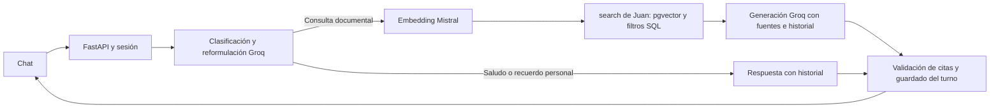

# Integración realizada: motor de Juan + producto de Jenaro

Actualización local del 09-09-2026, sin push. Base remota: `f82fdd8`.

## Flujo



`VectorBackend` en `vector_backend.py` adapta `etapa2_rag.rag.retrieval.search`
al contrato `Source/Generation` de nuestra API. No implementa otro índice.
Mantiene la generación de `GroqBackend`, incluidos límites de tokens,
`MessagesPlaceholder`, historial de seis intercambios y respuestas JSON validadas.

La función `answer_question()` de Juan sigue disponible para su script manual.
La API no la llama directamente porque entrega fuentes resumidas y citas con
otro formato; componer su recuperador con nuestro generador preserva las fuentes
completas y evita ejecutar dos cadenas de generación o dos memorias.

## Ajustes locales al código recibido

- Imports relativos para poder usar `etapa2_rag.rag` desde la API y seguir
  ejecutando los scripts de Juan como `rag`.
- `search()` admite `articulo_sufijo`, conserva `nivel1/ley_referenciada`,
  valida los filtros antes de llamar a Mistral y parametriza los valores SQL.
- Artículos numéricos explícitos pasan a filtros SQL; ausencia de sufijo implica
  `IS NULL`, no mezcla con bis. Filtros contradictorios producen abstención.
- Ranking coseno **exacto** para 140 filas con `SET LOCAL enable_indexscan=off`.
  No depende del recall del IVFFlat creado por el esquema sobre una tabla vacía.
  El índice original no se borró. Si el corpus crece, reevaluar esta decisión.
- Conexión SQL con 5 s de timeout de conexión y 5 s de statement_timeout.
- Embeddings validados: cantidad, orden, 1024 dimensiones, valores finitos y
  vector no nulo. Endpoint/modelo restringidos al índice que se construyó.
- Indexador con lotes atómicos, pausa de frecuencia y actualización de metadatos
  completos al hacer upsert. No cambia los archivos originales.
- Dependencias unificadas desde `etapa3_producto/requirements.txt`, eliminando
  pins contradictorios entre etapas. No se necesita el paquete `langchain`
  completo porque las importaciones usan core/openai.
- Compose raíz contiene db/api/frontend. No requiere el Compose separado de Juan.

## Contrato

`retrieve(query, top_k, filters)` devuelve texto, fuente, chunk_id, etiquetas y
similitud coseno (1 - distancia); la puntuación no es probabilidad de verdad.
`generate(question, history, sources)` devuelve respuesta, IDs citados y abstención.
`plan_query` y `converse` separan la conversación personal de las consultas a la ley.

En live, el fallo de DB, Mistral, Groq, JSON o validación produce 503 sin guardar
el turno y sin sustituir fuentes vectoriales por búsqueda léxica.
No se usa la ausencia de una cita como prueba de que una norma no existe.

## Activación y limitaciones

```dotenv
RAG_MODE=live
RAG_BACKEND_FACTORY=etapa3_producto.vector_backend:create_backend
```

Las claves y la contraseña están exclusivamente en `.env` ignorado por Git.
Ver [ejecución](README.md) y [evidencia](../docs/INTEGRACION_VECTORIAL_20260909.md).

Persisten límites: memoria RAM/un worker, cuotas externas, máximo cinco fuentes,
corpus modificatorio, necesidad de revisión semántica humana y ausencia de
autenticación para exposición pública. No publicar este servicio tal como está.

La búsqueda exacta se fundamenta en la [documentación de pgvector](https://github.com/pgvector/pgvector#querying),
que distingue el ranking exacto del tradeoff de recall de índices aproximados.
Las guías PostgreSQL/FastAPI orientaron transacciones por lote, SQL parametrizado,
timeouts y conservación del contrato de respuestas tipadas.
